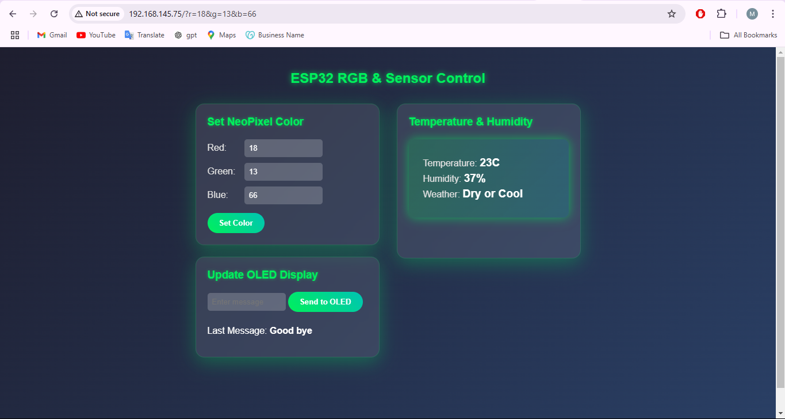
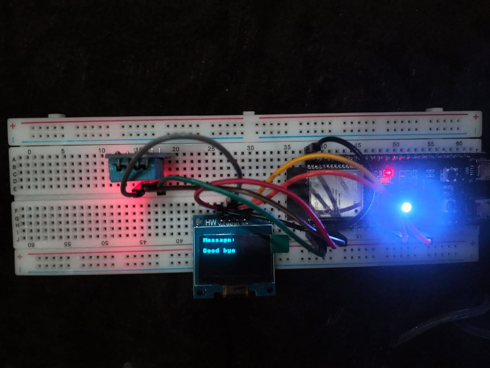

# IoT_Assignment_WebServer
# Web Dashboard Design (Task1)

# Circuit Design (Working)

# Web Dashboard Design (Task2-Game Chat Server)

# Team Contributions
# Environmental Monitoring System
Muneeb Ur Rehman: Designed the additional weather inference module that analyzes temperature and humidity data to determine weather conditions. Also led the overall webpage design and user interface implementation.
Swaiba Shahid: Developed the core functionality for displaying real-time temperature and humidity data on the web interface and implemented the text display feature for the OLED screen.
Adifa Jahangir: Created the module for controlling the RGB NeoPixel light, enabling web-based color customization through HTTP requests.
# Interactive Dice Game Server
Muneeb Ur Rehman: Architected the game logic, implemented the turn-based mechanics, and designed the web interface for the multiplayer dice game.
Adifa Jahangir & Muneeb Ur Rehman: Collaboratively developed the real-time chat functionality, enabling players to communicate during the game.
